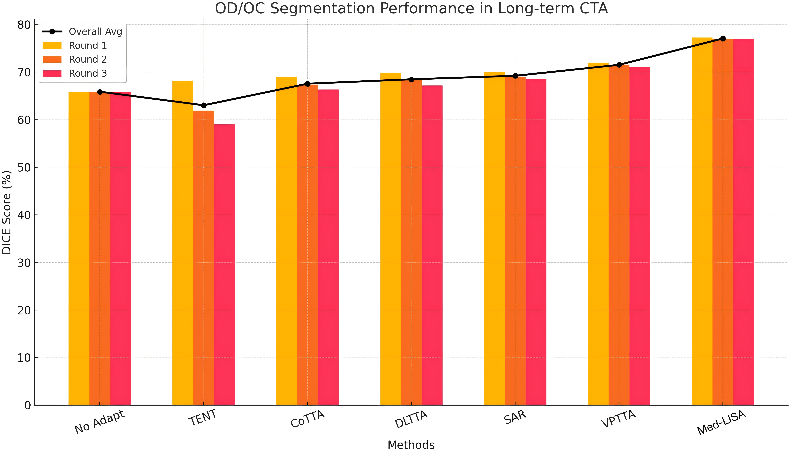
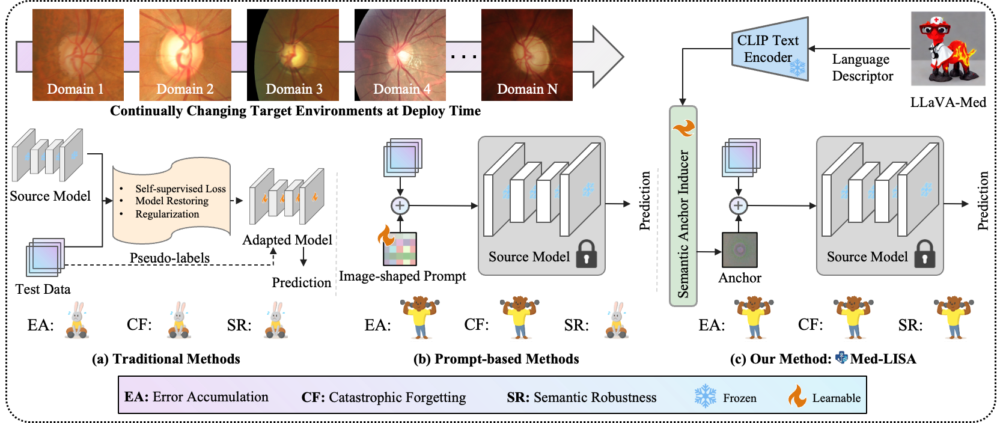

<div align="center">
<div class="logo">
   <a href="https://github.com/anonymous/Med-LISA">
      
   </a>
</div>
<h1>Med-LISA: Deploy-Time Medical Image Segmentation via Language-Induced Semantic Anchor</h1>
💡 Med-LISA enables deploy-time continual medical image segmentation by generating language-induced semantic anchors that enhance structural robustness without accessing source data or modifying the source model.


</div>


## 📊 Results  

The performance of Med-LISA and competing methods on the OD/OC segmentation task under long-term CTTA,
evaluated using DICE.

<div class="logo">
   <a href="https://github.com/anonymous/Med-LISA">
      
   </a>
</div>


## ⭐ Key Highlights

- **No source data required** – fully deploy-time adaptation.
- **No backbone updates** – prevents catastrophic forgetting and ensures stable inference.
- **Language-Induced Semantic Anchors** preserve anatomical structure under domain shift.
- **Reliable pseudo-label refinement** suppresses noise and reduces error accumulation.
- **Lightweight & real-time adaptation** — suitable for streaming clinical deployment scenarios.
- **Consistent SOTA performance** across OD/OC, Polyp, and Prostate MRI segmentation tasks.


<h2 style="text-align: left;">📌 Updates</h2>

**2025.11.08**: Upload the code for OD&OC segmentation. This is the first submission. After the article is accepted, the code will be sorted out and instructions will be added.
**2025.10.04**: Repository created.

## ✅ TODO  
- [ ] Release additional datasets and source-domain model code. 
- [x] Code will be released soon. 


## 📖 Overview  

Compared with traditional approaches, our method Med-LISA effectively alleviates error accumulation and catastrophic forgetting during deployment, and demonstrates superior semantic robustness over existing solutions.

<div class="logo">
   <a href="https://github.com/anonymous/Med-LISA">
      
   </a>
</div>

## 🛠️ Dependencies & Installation  

### 1️⃣ Clone the Repository  
```bash
git clone git@github.com:anonymous/Med-LISA.git
cd Med-LISA
```

### 2️⃣ Create Conda Environment & Install Dependencies  
```bash
conda create -n LISA python=3.8 -y  
conda activate LISA
pip3 install -r requirements.txt  
```

## 🚀 Get Started  

### 📂 Dataset Preparation  

- Download the OD and OC segmentation dataset using the following command:
```bash
wget https://oneflow-static.oss-cn-beijing.aliyuncs.com/data_lx/Fundus.zip
```

### ⚡ Quick Test 🏂  


- Run the following command to perform a quick inference:  
```bash
bash LISA_OPTIC.sh
```

## 📜 Citation (TODO)


## 📄 License  
The code and models are licensed under <a rel="license" href="./LICENSE">MIT License</a>. 

## 📬 Contact (anonymous)


## 🙌 Acknowledgement

The code is inspired by [GraTa](https://github.com/Chen-Ziyang/GraTa), [VPTTA](https://github.com/Chen-Ziyang/VPTTA), [DLTTA](https://github.com/med-air/DLTTA), and [DomainAdaptor](https://github.com/koncle/DomainAdaptor).


## 🧩 Related Projects

- [LLaVA-Med](https://github.com/microsoft/LLaVA-Med)
- [BiomedCLIP](https://huggingface.co/microsoft/BiomedCLIP-PubMedBERT_256-vit_base_patch16_224)
- [Instruction Tuning with GPT-4](https://github.com/Instruction-Tuning-with-GPT-4/GPT-4-LLM)
